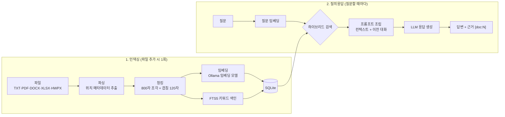

# DocuWizard

로컬에서 문서를 벡터화하고, LLM으로 **근거 기반** 질의응답을 하는 데스크톱 앱입니다.  
사업·입찰 지침, RFP, 양식을 프로젝트에 모아 두고 준비 포인트와 의문점에 대해 안전하게 조언을 받을 수 있습니다.

## 왜 DocuWizard인가

- **로컬 우선** — 기본은 문서·임베딩·검색이 기기 안에서만 동작합니다.
- **다중 프로젝트** — 사업별로 프로젝트를 나누고, 프로젝트마다 여러 파일을 등록합니다.
- **다양한 포맷** — TXT, PDF, DOCX, HWPX, Excel, 이미지(OCR).
- **근거 표시** — 답변이 어떤 파일의 어느 위치(페이지/라인/셀 등)에 기반했는지 표시합니다.
- **질답 이력** — 대화가 남아 나중에 다시 찾아볼 수 있습니다.
- **즐겨찾기(★)** — 중요 대화·답변을 모아볼 수 있습니다.
- **필수 포인트 추천** — 과업 진행에 꼭 알아둬야 할 항목을 요약·추천하고 근거와 함께 보여 줍니다.
- **LLM 선택** — Ollama(gemma 등) 기본 + OpenAI / Anthropic 선택.

## 동작 원리

DocuWizard는 "문서를 미리 잘게 쪼개 색인해 두고, 질문이 오면 관련 조각만 찾아
LLM에게 근거로 제시하는" **RAG(Retrieval-Augmented Generation)** 구조입니다.



### 1. 인덱싱 — 문서를 검색 가능한 조각으로

1. **파싱** — 파일 형식별 파서가 텍스트를 추출하면서 위치 정보(페이지, 라인,
   시트/셀)를 함께 기록합니다. 이 정보가 나중에 답변의 근거 표시에 쓰입니다.
2. **청킹** — 추출된 텍스트를 약 800자 조각(청크)으로 자릅니다. 조각 사이를
   120자씩 겹치게 해서 문장이 조각 경계에서 잘려 의미를 잃는 것을 줄입니다.
3. **이중 색인** — 각 청크를 두 가지 방식으로 색인합니다.
   - **벡터(임베딩)**: Ollama 임베딩 모델(예: `nomic-embed-text`)이 청크의
     "의미"를 숫자 벡터로 변환해 저장합니다. 표현이 달라도 뜻이 비슷하면
     찾을 수 있습니다.
   - **키워드(FTS5)**: SQLite 전문 검색 색인입니다. 트라이그램(3글자 단위)
     방식이라 "마감일은"처럼 조사가 붙은 한국어도 "마감일"로 부분 일치합니다.

### 2. 검색 — 하이브리드(벡터 + 키워드)

질문이 들어오면 두 검색을 모두 실행한 뒤 **RRF(Reciprocal Rank Fusion)**로
순위를 합칩니다. 각 검색에서 순위가 r인 청크에 `1/(60+r)` 점을 주고 합산하는
방식입니다.

- **벡터 검색**이 잘하는 것: 다르게 표현된 같은 의미 ("제출 기한" ↔ "마감일")
- **키워드 검색**이 잘하는 것: 고유명사·숫자·전문용어의 정확한 일치
  ("특별예산", "3억", "FTS5")

점수 척도가 서로 다른 두 검색(코사인 유사도 vs BM25)을 안전하게 합치기 위해
점수 자체가 아닌 **순위**만 사용합니다.

### 3. 답변 — 근거를 제시하고 인용을 요구

검색된 상위 청크(top_k, 기본 5개)를 `[doc:1]`, `[doc:2]`… 번호와 위치 정보를
붙여 프롬프트에 넣고, LLM에게 다음을 지시합니다.

- 제공된 컨텍스트만 사용해 답할 것 (없으면 모른다고 답할 것)
- 근거가 되는 문서를 `[doc:N]` 형식으로 인용할 것

이전 대화 최대 6개 메시지(4,000자 한도)도 함께 전달되어 "그럼 그 서류는
어디에 내?" 같은 후속 질문이 자연스럽게 이어집니다. 답변의 인용 번호는 원본
청크와 연결되어 화면 하단 근거 패널에서 파일·페이지·라인을 확인할 수 있습니다.

### 필수 포인트 리포트

같은 검색 엔진을 6개 카테고리(일정·마감, 제출물, 자격·제한, 평가·배점,
의무·금지, 리스크·주의)의 대표 질의어로 실행하고, 카테고리마다 LLM이 핵심
항목을 bullet로 요약합니다. 각 항목도 근거 청크와 연결됩니다.

## 기술 스택

| 영역 | 기술 |
|------|------|
| 언어 | Python 3.11+ |
| GUI | PySide6 |
| DB | SQLite (임베딩 BLOB + FTS5 전문 검색) |
| LLM | Ollama / OpenAI / Anthropic |
| 패키징 | PyInstaller (`packaging/docuwizard.spec`) |

## 상태

✅ **MVP 기능 구현 완료 (M0–M6 + M8 P0/P1)** — M7 패키징·라이선스·e2e 스모크 포함.

- 제품 요구사항: [docs/PRD.md](docs/PRD.md)
- GitHub 마일스톤·이슈 백로그: [docs/GITHUB_BACKLOG.md](docs/GITHUB_BACKLOG.md)
- 데이터 경로: [docs/DATA_PATHS.md](docs/DATA_PATHS.md)
- 서드파티 라이선스: [docs/THIRD_PARTY.md](docs/THIRD_PARTY.md)
- Project 보드: https://github.com/users/progh2/projects/19

## 빠른 시작

저장소를 받은 뒤, OS에 맞는 실행 스크립트만 실행하면 됩니다.
처음 실행 시 `.venv` 생성과 패키지 설치를 자동으로 합니다.

| OS | 실행 |
|----|------|
| Windows | `scripts\run-windows.bat` 더블클릭, 또는 `.\scripts\run-windows.ps1` |
| macOS | `chmod +x scripts/run-macos.sh && ./scripts/run-macos.sh` |
| Linux | `chmod +x scripts/run-linux.sh && ./scripts/run-linux.sh` |

수동으로 실행하려면:

```bash
python -m venv .venv
# Windows: .venv\Scripts\activate
# macOS/Linux: source .venv/bin/activate
pip install -e ".[dev]"
python -m docuwizard
```

개발 검사:

```bash
ruff check src tests
pytest -q
```

Ollama 설치 후 예: `ollama pull gemma2` (모델명은 설정에서 변경)

## 이미지 OCR 준비 — Tesseract 설치

### Tesseract란?

**Tesseract**는 이미지 속 글자를 텍스트로 바꿔 주는 무료 오픈소스
OCR(광학 문자 인식) 엔진입니다. 구글이 오랫동안 관리해 왔고, 한국어를 포함한
100여 개 언어를 지원합니다.

DocuWizard에서는 스캔한 공고문, 사진으로 찍은 안내문, 캡처 이미지 같은
**이미지 파일(PNG/JPG/BMP/TIFF/WebP)을 프로젝트에 추가할 때만** 사용됩니다.
텍스트·PDF·워드·엑셀·한글 문서만 쓴다면 설치하지 않아도 됩니다.

Tesseract는 파이썬 패키지가 아니라 **별도 프로그램**이라서 한 번만 직접
설치해 주면 됩니다. OCR 처리도 인터넷 연결 없이 전부 내 컴퓨터 안에서
이루어지므로 이미지가 외부로 전송되지 않습니다.

### Windows 설치 (권장: UB Mannheim 빌드)

1. 다운로드 페이지에서 최신 설치 파일(`tesseract-ocr-w64-setup-….exe`)을
   받습니다: https://github.com/UB-Mannheim/tesseract/wiki
2. 설치 파일을 실행하고 안내를 따라 진행합니다.
3. **중요:** "Choose components(구성 요소 선택)" 화면에서
   **Additional language data** 항목을 펼쳐 **Korean**을 체크하세요.
   이걸 빠뜨리면 한국어 이미지가 인식되지 않습니다.
   (빠뜨렸다면 설치 파일을 다시 실행해 추가하면 됩니다.)
4. 설치 경로는 기본값(`C:\Program Files\Tesseract-OCR`)을 그대로 두면 됩니다.
5. 설치 마지막 단계 또는 설치 후에 Tesseract가 **PATH**에 등록되어야
   DocuWizard가 찾을 수 있습니다. 확인 방법: 새 명령 프롬프트(cmd)를 열고

```bash
tesseract --version
```

   버전이 출력되면 성공입니다. "명령을 찾을 수 없습니다"가 나오면
   `시스템 환경 변수 편집 → 환경 변수 → Path → 새로 만들기`에
   `C:\Program Files\Tesseract-OCR`를 추가한 뒤 **DocuWizard를 재시작**하세요.

### macOS 설치

```bash
brew install tesseract tesseract-lang
```

`tesseract-lang`에 한국어를 포함한 추가 언어팩이 들어 있습니다.

### Linux (Ubuntu/Debian) 설치

```bash
sudo apt install tesseract-ocr tesseract-ocr-kor
```

### 설치 확인

```bash
tesseract --version        # 버전이 나오면 설치 성공
tesseract --list-langs     # 목록에 kor가 있으면 한국어 인식 가능
```

### 자주 겪는 문제

| 증상 | 원인 · 해결 |
|------|-------------|
| 이미지 인덱싱 시 "Tesseract OCR이 설치되어 있지 않습니다" 오류 | Tesseract 미설치 또는 PATH 미등록. 위 설치 후 앱 재시작 |
| 한국어가 깨지거나 빈 결과 | 한국어 언어팩(kor) 누락. `tesseract --list-langs`로 확인 후 언어팩 추가 (한국어 팩이 없으면 자동으로 영어로만 재시도합니다) |
| 인식 정확도가 낮음 | 해상도가 낮거나 기울어진 이미지는 인식률이 떨어집니다. 300dpi 이상 스캔, 수평 맞춤, 선명한 원본을 권장 |

## 실행 파일 빌드

개발용으로는 위 실행 스크립트가 가장 쉽습니다. 배포용 폴더형 실행 파일은
PyInstaller로 만들 수 있습니다.

**Windows:** `.\packaging\build.ps1` → `dist\DocuWizard\DocuWizard.exe`

**macOS / Linux:**

```bash
chmod +x scripts/build-unix.sh
./scripts/build-unix.sh
# 결과: dist/DocuWizard/DocuWizard
```

수동 빌드: `pip install -e ".[dev,packaging]"` 후
`pyinstaller packaging/docuwizard.spec --noconfirm --clean`

**참고**

- Ollama·Tesseract는 실행 파일에 포함되지 않습니다. 사용자 PC에 각각 설치되어
  있어야 로컬 모델·이미지 OCR을 쓸 수 있습니다.
- 첫 빌드는 PySide6를 묶어 용량이 큽니다(수백 MB).
- 플랫폼별로 한 번씩 빌드해야 합니다.

## 보안 안내

- **기본 모드**에서는 문서가 외부로 전송되지 않습니다.
- 외부 API(ChatGPT / Claude 등)를 선택하면 **질문과 검색된 문서 조각**이 해당 제공자로 전송됩니다. 설정 화면에 경고가 표시됩니다.
- 임베딩(문서 색인)은 외부 프로바이더를 선택해도 **항상 로컬 Ollama**에서 수행됩니다. 문서 전체가 아니라 답변에 필요한 검색 결과만 전송됩니다.
- API 키는 설정 파일과 분리된 로컬 파일(사용자 설정 폴더의 `secrets.json`)에 저장되며 저장소에 커밋되지 않습니다.

## 개발·기여

GitHub **Issues / Milestones / Projects**로 작업을 분해해 진행합니다.

1. [docs/GITHUB_BACKLOG.md](docs/GITHUB_BACKLOG.md)의 이슈를 GitHub에 등록
2. Milestone(M0–M7)·Label을 연결
3. Project 보드: Backlog → Ready → In Progress → Review → Done
4. PR은 이슈 번호를 포함하고 Acceptance Criteria를 충족해야 합니다.

## 라이선스

[MIT](LICENSE) — 서드파티 고지는 [docs/THIRD_PARTY.md](docs/THIRD_PARTY.md)를 참고하세요.
